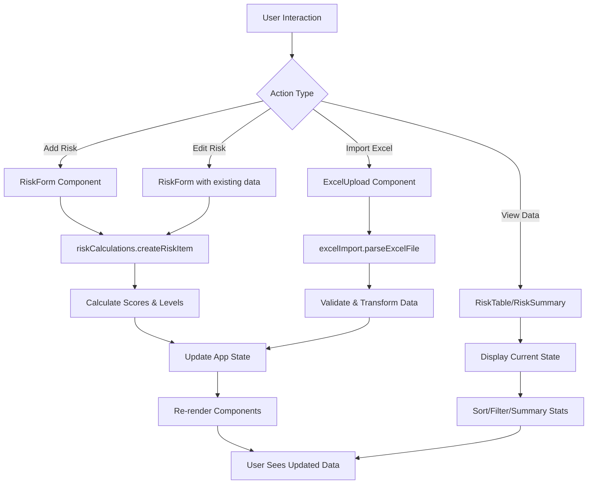

# Risk Management Dashboard - Explained for Flask Developers

## What This Application Does

Think of this as a **web-based risk assessment tool** - similar to a Flask dashboard you might build for managing business risks. Instead of Flask + Jinja2 templates, this uses **Next.js + React** (but the concepts are very similar).

**Core Functionality:**
- ✅ **CRUD operations** for risk records (like SQLAlchemy models)
- 📊 **Dashboard views** with summary statistics
- 📤 **Excel import/export** functionality
- 🧮 **Automatic risk calculations** (probability × impact = risk score)
- 🏷️ **Risk categorization** and status tracking
- 🔄 **Real-time data updates** (no page refreshes needed)

---

## Architecture Overview: Flask vs This App

| Flask App | This Next.js App | Purpose |
|-----------|------------------|---------|
| `app.py` (main Flask app) | `src/app/page.tsx` | Main application entry point |
| Flask routes (`@app.route`) | React components | Handle different pages/views |
| SQLAlchemy models | `src/types/risk.ts` | Data structure definitions |
| Helper functions | `src/utils/` | Business logic and calculations |
| Templates (`*.html`) | React JSX | User interface |
| Static data/fixtures | `src/data/sampleRisks.ts` | Sample/seed data |

---

## File Structure & Purpose

### 🏗️ **Core Application (`src/app/`)**
```
src/app/
├── page.tsx          # Main dashboard (like your Flask app's home route)
├── layout.tsx        # App-wide layout (like your base.html template)
└── globals.css       # Global styles
```

**`page.tsx`** - The Main Controller
- **Flask equivalent**: Your main `@app.route('/')` function
- **What it does**: 
  - Manages all risk data in state (like session data)
  - Handles CRUD operations (add, edit, delete, update status)
  - Controls which view is displayed (summary vs table)
  - Manages modal dialogs for forms

### 📊 **UI Components (`src/components/`)**
Think of these as **reusable Jinja2 macros**, but more powerful:

```
src/components/
├── RiskTable.tsx     # Data table with sorting/filtering
├── RiskSummary.tsx   # Dashboard with charts and stats
├── RiskForm.tsx      # Add/edit form modal
└── ExcelUpload.tsx   # File upload component
```

**Each component is like a Flask function that returns HTML:**
- `RiskTable` = Your data table template with sorting/filtering
- `RiskSummary` = Dashboard with statistics (like a Flask route that calculates metrics)
- `RiskForm` = Modal form for adding/editing (like a WTForms form)
- `ExcelUpload` = File upload handler

### 🔧 **Business Logic (`src/utils/`)**
```
src/utils/
├── riskCalculations.ts  # Core business logic
└── excelImport.ts      # File processing logic
```

**`riskCalculations.ts`** - The Business Rules Engine
- **Flask equivalent**: Helper functions or service classes
- **Functions**:
  - `calculateRiskScore()` - Multiplies probability × impact
  - `getRiskLevel()` - Determines risk category (LOW, MEDIUM, HIGH, etc.)
  - `calculateResidualScore()` - Applies mitigation effectiveness
  - `generateRiskSummary()` - Creates dashboard statistics

**`excelImport.ts`** - File Processing
- **Flask equivalent**: Excel processing with `pandas` or `openpyxl`
- **Functions**:
  - `parseExcelFile()` - Reads Excel files and validates data
  - `createExcelTemplate()` - Generates downloadable template

### 📝 **Data Models (`src/types/`)**
```typescript
// src/types/risk.ts - Like your SQLAlchemy models
interface RiskItem {
  id: string;
  description: string;
  probability: number;        // 1-9 scale
  impact: number;            // 1-9 scale
  score: number;             // calculated: probability × impact
  riskLevel: string;         // "LOW", "MEDIUM", "HIGH", etc.
  mitigationEffectiveness: number;  // 0-1 (0% to 100%)
  residualScore: number;     // after mitigation
  owner?: string;
  category?: string;
  status: 'Open' | 'In Progress' | 'Mitigated' | 'Closed';
  // ... other fields
}
```

### 🗃️ **Sample Data (`src/data/`)**
```
src/data/
└── sampleRisks.ts    # Like Flask fixtures or seed data
```

---

## How Data Flows Through the System

### 📋 **Data Flow Diagram**



### 🔄 **Function Interaction Flow**

1. **User adds a new risk:**
   ```
   RiskForm → createRiskItem() → calculateRiskMetrics() → Update state → Re-render table
   ```

2. **User imports Excel file:**
   ```
   ExcelUpload → parseExcelFile() → validateExcelRow() → createRiskItem() → Update state
   ```

3. **User views dashboard:**
   ```
   RiskSummary → generateRiskSummary() → Display charts and stats
   ```

4. **User filters/sorts table:**
   ```
   RiskTable → Filter/sort logic → Display filtered results
   ```

---

## Key Functions Explained

### 🧮 **Risk Calculation Engine**

```typescript
// Like a Flask helper function
function calculateRiskScore(probability: number, impact: number): number {
  return probability * impact;  // Simple multiplication
}

function getRiskLevel(score: number): RiskLevel {
  // Business rules - like conditional logic in Flask
  if (score >= 36) return "HIGHEST";
  if (score >= 25) return "HIGH";
  if (score >= 16) return "MEDIUM";
  // ... etc
}
```

**Flask equivalent:**
```python
def calculate_risk_score(probability, impact):
    return probability * impact

def get_risk_level(score):
    if score >= 36:
        return "HIGHEST"
    elif score >= 25:
        return "HIGH"
    # ... etc
```

### 📤 **Excel Import Process**

```typescript
// Like Flask file upload processing
function parseExcelFile(file: File): Promise<ImportResult> {
  // 1. Read Excel file (like pandas.read_excel())
  // 2. Map column headers to our data structure
  // 3. Validate each row
  // 4. Transform data into RiskItem objects
  // 5. Return results with any errors
}
```

**Flask equivalent:**
```python
def process_excel_upload(file):
    df = pd.read_excel(file)
    risks = []
    errors = []
    
    for index, row in df.iterrows():
        try:
            risk = create_risk_from_row(row)
            risks.append(risk)
        except ValidationError as e:
            errors.append(f"Row {index}: {e}")
    
    return {"risks": risks, "errors": errors}
```

---

## Component Interaction Map

```
┌─────────────────┐    ┌─────────────────┐    ┌─────────────────┐
│   RiskSummary   │    │    RiskTable    │    │    RiskForm     │
│                 │    │                 │    │                 │
│ - Shows stats   │    │ - Lists risks   │    │ - Add/edit form │
│ - Charts        │    │ - Sorting       │    │ - Validation    │
│ - Alerts        │    │ - Filtering     │    │ - Save/cancel   │
└─────────────────┘    └─────────────────┘    └─────────────────┘
         │                       │                       │
         │                       │                       │
         └───────────────────────┼───────────────────────┘
                                 │
                    ┌─────────────────┐
                    │   Main App      │
                    │   (page.tsx)    │
                    │                 │
                    │ - Manages state │
                    │ - CRUD ops      │
                    │ - Modal control │
                    └─────────────────┘
                                 │
                    ┌─────────────────┐
                    │  ExcelUpload    │
                    │                 │
                    │ - File upload   │
                    │ - Data import   │
                    │ - Error display │
                    └─────────────────┘
```

---

## Running the Application

### 🚀 **Setup (Like setting up a Flask app)**

```bash
# Install dependencies (like pip install -r requirements.txt)
npm install

# Run development server (like flask run)
npm run dev

# Build for production (like creating a deployment package)
npm run build

# Run tests
npm test
```

### 🌐 **Access the Application**
- Development: http://localhost:3000
- The app runs entirely in the browser (no backend database needed)
- Data is stored in memory (resets on page refresh)

---

## Key Differences from Flask

| Aspect | Flask | This App |
|--------|-------|----------|
| **Data Storage** | Database (SQLite, PostgreSQL, etc.) | In-memory (browser state) |
| **Page Updates** | Full page refresh | Real-time updates (no refresh) |
| **Templates** | Jinja2 server-side rendering | React client-side rendering |
| **Forms** | WTForms + POST requests | React forms with state |
| **File Upload** | Flask file handling | Browser-based file processing |
| **Routing** | URL routes (`@app.route`) | Component-based navigation |

---

## Extending the Application

### 🔧 **To add a new risk field:**
1. Update `RiskItem` interface in `src/types/risk.ts`
2. Modify `RiskForm.tsx` to include the new field
3. Update `RiskTable.tsx` to display it
4. Add validation in `riskCalculations.ts` if needed

### 📊 **To add new dashboard metrics:**
1. Create calculation functions in `riskCalculations.ts`
2. Update `generateRiskSummary()` function
3. Modify `RiskSummary.tsx` to display new metrics

### 📤 **To modify Excel import:**
1. Update column mapping in `excelImport.ts`
2. Add validation rules in `validateExcelRow()`
3. Test with sample Excel files

---

## Summary

This Risk Management Dashboard is essentially a **single-page application** that does what you'd build with Flask, but runs entirely in the browser. Instead of:
- Database → SQLAlchemy models → Flask routes → Jinja2 templates
- You have: Browser state → TypeScript types → React components → JSX templates

The business logic (risk calculations, Excel processing) is very similar to what you'd write in Flask - just in TypeScript instead of Python!